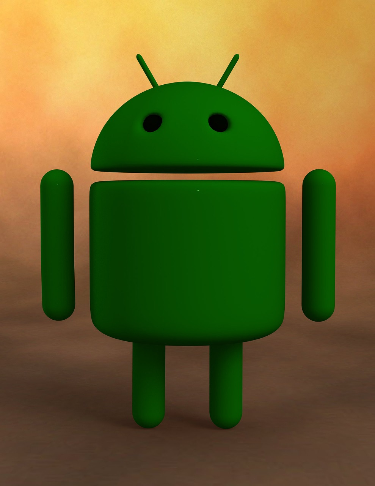

### Hi there, I'm [Mohit!](https://www.warmodroid.xyz) 👋.

 

 

 

### Hi 🙋‍♂️,
### I'm 24 years old Self-taught mobile app developer from India 👨🏻‍💻.

#### -  🧑🏻‍💻 Learning Flutter  <code></code>

#### - 🤳 Native android app <code></code>

#### - 🦾🧠 Pro into native iOS app

#### - 💬 Connect? Here 👉🏼

 

**I am Into , 🙏**

**native iOS and android app development, will become pro in Flutter 😼**
 

*************

 

### - Languages and Tools...

<!-- For more icons please follow  https://github.com/MikeCodesDotNET/ColoredBadges -->
    

### - Blog 🌱

 

***********************************

#### Thank You-🙏🏼
